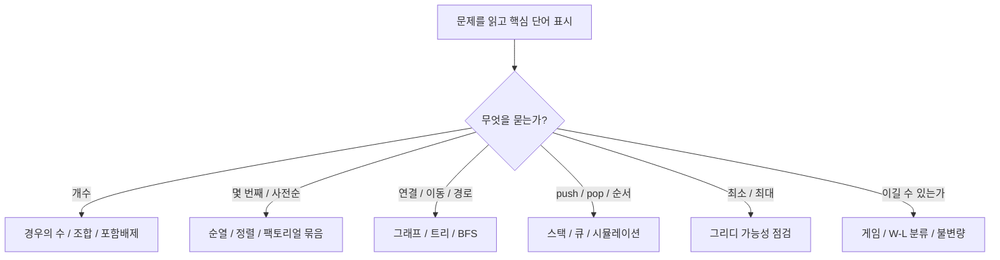

---
description:
aliases:
created: 2026-05-01
modified: 2026-05-02
---

# 들어가며
- *80*분에 *20~25*문제 - 200점 만점
- 60개 이하의 직접 계산이 가능한 문제는 시도해봐도 됨
	- 그 이상을 넘어가면 공식이나, 패턴을 찾기
- 10번 이후의 주관식은 난이도가 높다
- 인터랙티브가 점수가 높으니, 도전해보자

## 점수 분포
### 초등부
- ![[image-파이날 특강 자료.png|800]]
- ![[image-파이날 특강 자료-2.png|800]]

### 중등부
-  ![[image-파이날 특강 자료-1.png|800]]
- ![[image-파이날 특강 자료-3.png|800]]

# 0. 특강 개요

## 분석 범위

- 대상: 2019~2025 KOI 1교시 초등부, 중등부, 고등부
- 총 문항 수: $21 \times 20 = 420$문항

## 기출에서 반복적으로 많이 보이는 축

| 주제              |          대략적 반복도 | 대표 예시                                              |
| --------------- | ---------------: | -------------------------------------------------- |
| [[순열과 조합]] |       약 140문항 이상 | 2024 중등 `두 개씩 곱하기`, 2025 고등 `투표 결과`                |
| [[그래프]], [[트리]]         |        약 70문항 이상 | 2024 중등 `그래프의 중심`, `최소 신장 트리`, 2022 초등 `두 트리 연결하기` |
| 순열, 사전순, 정렬     |        약 50문항 이상 | 2024 중등 `순열 찾기`, 2025 고등 `숫자 제거`                   |
| 그리디, 시뮬레이션, 역추적 |        약 60문항 안팎 | 2025 고등 `마법 문자열`, 2024 중등 `최소 신장 트리`               |
| [[확률]]              |        약 30문항 안팎 | 2020 중등 `가위바위보 확률`, 2021 중등 `동전과 확률`               |
| [[이진 논리와 진법 변환]], 비트     |        약 30문항 안팎 | 2024 중등 `진법 변환`, 2019 중등 `곱의 이진수 끝자리`              |
| 게임, 불변량         |        약 40문항 안팎 | 2025 고등 `돌 가져가기 게임`, 2022 초등 `게임`                  |
| [[스택과 큐]]           | 직접 명시 출제는 적지만 중요 | 2025 초/중/고 `스택`, BFS와 그래프 탐색의 핵심 도구                |

<!--
## 120분 운영안

| 시간 | 챕터 | 핵심 목표 |
| --- | --- | --- |
| 10분 | 기출 분석과 문제 읽는 법 | 문제를 보면 어떤 분류로 들어가는지 먼저 판단 |
| 15분 | 진법, 2진수, 진법 변환 | 자리값 표현과 묶음 변환 숙달 |
| 25분 | 경우의 수, 조합, 순열, 사전순 | KOI 빈출 계산 뼈대 정리 |
| 20분 | 확률, 집합, 포함배제, 논리 | “겹침”, “조건”, “참거짓” 정리 |
| 25분 | 그래프와 트리 | 연결 구조, 경로, 차수, MST, 순회 이해 |
| 10분 | 스택과 큐, 시뮬레이션 | 자료구조의 동작 순서 체득 |
| 15분 | 알고리즘 사고: 그리디, 역추적, 게임, 불변량 | 전략 선택 기준 정리 |
-->

## 문제를 읽고 분류하는 1차 체크

---

# 1. 진법, 2진수, 진법 변환

## 1-1. 왜 자주 나오는가

KOI에서는 진법 문제를 단순 계산으로 내기도 하지만, 실제로는 다음과 같은 사고를 묻는 경우가 많다.

- 수를 자리값의 합으로 표현할 수 있는가
- 2진수로 바꾼 뒤 규칙을 더 쉽게 볼 수 있는가
- 비트 단위의 규칙이 반복되는가

## 1-2. 기초 이론

### 자리값 표현

$b$진수 $a_k a_{k-1} \cdots a_1 a_0$는 다음과 같다.

$$
(a_k a_{k-1} \cdots a_1 a_0)_b
=
\sum_{i=0}^{k} a_i b^i
$$

예를 들어

$$
(4321)_5 = 4\cdot 5^3 + 3\cdot 5^2 + 2\cdot 5 + 1
$$

이다.

### $10$진수 $\to b$진수 변환

반복해서 $b$로 나누고 나머지를 기록한다.

예를 들어 $345$를 $3$진수로 바꾸면

$$
345 \div 3 = 115 \text{ remainder } 0
$$
$$
115 \div 3 = 38 \text{ remainder } 1
$$
$$
38 \div 3 = 12 \text{ remainder } 2
$$
$$
12 \div 3 = 4 \text{ remainder } 0
$$
$$
4 \div 3 = 1 \text{ remainder } 1
$$
$$
1 \div 3 = 0 \text{ remainder } 1
$$

따라서

$$
345_{10} = 110210_3
$$

이다.

### $2$진수와 $8$진수, $16$진수의 관계

- $8 = 2^3$이므로 $8$진수 한 자리는 $2$진수 세 자리와 대응
- $16 = 2^4$이므로 $16$진수 한 자리는 $2$진수 네 자리와 대응

예:

$$
A6E4F3_{16}
$$

에서 각 자리를 $2$진수 네 자리로 바꾸면

$$
1010\ 0110\ 1110\ 0100\ 1111\ 0011
$$

이고, 이를 세 자리씩 끊으면 $8$진수로 바로 갈 수 있다.

### 비트 사고의 핵심

- 짝수/홀수는 맨 마지막 비트만 보면 된다.
- 어떤 연산이 반복되면 나머지나 비트 패턴의 주기를 찾는다.
- `AND`, `OR`, `XOR`는 자리별로 독립적으로 생각할 수 있다.

## 1-3. KOI에서 자주 나오는 포인트

- 진법 문제를 보면 중간에 $2$진수로 가는 것이 가장 안전하다.
- 마지막 자리, 자릿수 합, 연속된 $1$의 개수처럼 “전체가 아니라 일부 정보”를 묻는 경우가 많다.
- 매우 큰 수가 나오면 실제 값을 계산하지 말고 주기, 자리값, 나머지를 본다.

## 1-4. 실수 포인트

- 묶음이 맞지 않을 때 왼쪽에 $0$을 채우는 것을 빼먹음
- $10$진수로 환산할 때 지수 위치를 하나씩 밀림
- “나머지”와 “몫”을 뒤섞음

## 1-5. 연습 문제

1. $345_{10}$을 $3$진수로 바꾸어라.

## 1-6. 기출 문제
- [2024 중등 4번 `진법 변환`](https://www.biko.kr/problem/2256)
- [2019 중등 1번 `곱의 이진수 끝자리`](https://assets.koi.or.kr/koi/2019/1/m1-problems.pdf)
<!--
- 2025 고등 12번 `연산의 합`
-->

# 2. 경우의 수, 조합, 순열, 사전순

## 2-1. 왜 가장 중요하나

기출 분석에서 가장 많이 반복된 축이 바로 경우의 수와 조합이다. KOI 1교시에서는 “브루트포스로 세는 척하지만 실제로는 구조를 잡아야 빠른” 문제가 계속 나온다.

## 2-2. 가장 기본이 되는 원리

### 덧셈 원리

겹치지 않는 경우들이 여러 묶음으로 나뉘면 더한다.

$$
|A \cup B| = |A| + |B| \quad (\text{if } A \cap B = \varnothing)
$$
- 편의점에 갔는데 간식을 *딱 하나만*살 수 있는 경우
	- 살 수 있는 간식
		- 과자 3종류
		- 아이스크림 2종류
		- 빵 4종류
 - 과자를 고르거나, 아이스크림을 고르거나 빵을 고른다
 - **또는, or** 키워드

### 곱셈 원리

선택이 단계별로 이어지면 곱한다.

예를 들어 첫 번째 선택이 $m$가지, 두 번째가 $n$가지면 전체는 $mn$가지다.

- 편의점에서 세트로 사려는 경우
	- 세트는 다음처럼 구성되어야함
		- 과자 1개 + 음료 1개
	- 살 수 있는 간식 종류
		- 과자 3종류
		- 음료 2종류
- 과자를 1개 고르고, 음료도 1개 고른다
- **그리고, and** 키워드

### 순열

$n$개 중 $r$개를 골라 순서를 세우는 경우:
- 순서가 중요함

$$
{}_nP_r = \frac{n!}{(n-r)!}
$$

- 5명이 달리기해서 1등부터 3등까지 정한다면 경우의 수는?

### 조합

$n$개 중 $r$개를 골라 순서를 무시하는 경우:

$$
{}_nC_r = \binom{n}{r} = \frac{n!}{r!(n-r)!}
$$

- 5명의 회장 입후보 중, 2명에게 투표하는 경우의 수는?

## 2-3. KOI에서 특히 자주 쓰는 패턴

### 패턴 A: “앞부분만 정하면 뒤가 자동으로 정해지는” 경우

예:

- 회문
- 대칭 색칠
- 짝 맞추기

예를 들어 길이 $9$ 회문은 앞의 $5$자리만 정하면 뒤는 자동으로 정해진다.

### 패턴 B: “몇 자리를 지워서 얻는 수”

이때는 보통 `부분수열`이다. 즉, **고른 뒤 원래 순서를 유지한다.**

이 조건 때문에 “조합처럼 고르되, 고른 뒤 순서를 다시 섞지는 않는다.”

### 패턴 C: “몇 번째 순열인가”

사전순 순열에서는 다음 묶음이 팩토리얼 크기로 움직인다.

예를 들어 $1,2,3,4,5,6$의 순열을 사전순으로 나열하면

- 첫 자리가 $1$인 묶음은 $5!$개
- 첫 자리가 $2$인 묶음도 $5!$개
- ...

이다.

<!--
즉, $k$번째 순열은 `팩토리얼 진법`처럼 찾을 수 있다.
-->

### 패턴 D: 대칭성 활용

2025 고등 `투표 결과`처럼

- $A>B$
- $A<B$
- $A=B$

로 나눌 수 있다면, $A>B$와 $A<B$가 대칭일 수 있다. 그러면

$$
|A>B| = \frac{\text{전체} - |A=B|}{2}
$$

처럼 계산이 짧아진다.

## 2-4. 사전순 $k$번째 순열 찾기 요약

$n$개의 수를 사전순으로 나열했을 때, $k$번째 순열을 찾으려면:

<!--
 $k-1$번째라고 생각한다.
-->

1. 첫 자리를 $(n-1)!$로 나누어 몇 번째 묶음인지 본다.
2. 그 묶음에 해당하는 원소를 고른다.
3. 나머지에 대해 반복한다.

## 2-5. 실수 포인트

- 조합인지 순열인지 구분을 안 하고 무조건 $n!$을 씀
- 중복을 허용하는지 안 하는지 확인 안 함
- “몇 번째” 문제에서 $0$번째 기준으로 바꾸지 않아 계산이 꼬임
- 부분수열 문제에서 원래 순서를 깨뜨림

## 2-6. 연습 문제

1. $1,2,3,4,5$의 순열을 사전순으로 나열했을 때, $42$번째 순열을 구하여라.
2. (보류) 문자 `a,b,c`로 길이 $7$의 문자열을 만들 때, `a`가 정확히 $3$개이고 서로 이웃하지 않게 하는 경우의 수를 구하여라.

## 2-7 기출 문제
- [2021 초등 3번, 중등 1번 `다른 모자 쓰기`](https://www.biko.kr/problem/278)
	- 직접 계산
	- 교란순열(완전순열) 공식
		- 원래 위치에 있는 원소가 하나도 없는 순열
		- $D_n = (n-1)(D_{n-1} + D_{n-2})$ (점화식)
			- $n!\Sigma_{k=0}^{n} \frac{(-1)^k}{k!} = n!\left( \frac{1}{2!} - \frac{1}{3!} + \frac{1}{4!} - \cdots + \frac{(-1)^n}{n!} \right)$ (포함배제의 원리)
		- $D_1 = 0, D_2 = 1, D_3 = 2, D_4 = 9, D_5 = 44, D_6 = 265$
	- ![[image-파이날 특강 자료-5.png]]
- [2024 초등 2번, 중등 1번, 고등 1번 `두 개씩 곱하기`](https://www.biko.kr/problem/2253)
- [2024 중등 6번 `순열 찾기`:](https://www.biko.kr/problem/2260)
- [2025 초등 10번, 중등 6번, 고등 4번 `숫자 제거`](https://www.biko.kr/problem/5389)
- [2025 중등 9번, 고등 6번 `투표 결과`](https://www.biko.kr/problem/5392)
	- $3^7 = 2187$

# 3. 확률, 집합, 포함배제, 논리

## 3-1. 이 챕터가 필요한 이유

KOI에서 확률 문제는 단독으로도 나오지만, 실제로는 조합과 집합, 경우 분할, 논리 조건과 묶여서 자주 나온다.

## 3-2. 확률의 기본

동등하게 가능한 경우라면

$$
\Pr(A) = \frac{|A|}{|\Omega|}
$$

이다.

여기서

- $\Omega$: 전체 경우의 집합
- $A$: 원하는 사건

이다.

### 조합형 확률

두 개를 고르는 문제에서 순서가 중요하지 않으면 조합이 가장 깔끔하다.

예를 들어 10개 동전 중 $x$개가 특별한 면을 가진다면, 두 개를 뽑아 둘 다 특별할 확률은

$$
\frac{\binom{x}{2}}{\binom{10}{2}}
$$

이다.

## 3-3. 포함배제 원리

겹치는 조건은 단순히 더하면 중복된다.

### 두 집합

$$
|A \cup B| = |A| + |B| - |A \cap B|
$$

### 세 집합

$$
|A \cup B \cup C|
=
|A|+|B|+|C|
-|A\cap B|-|B\cap C|-|C\cap A|
+|A\cap B\cap C|
$$

- ![[집합(포함과 배제)#^24c7a6]]

예를 들어

- $3$의 배수
- $4$의 배수
- 그런데 $5$의 배수는 제외

같은 문제는 포함배제를 두 번 적용하면 된다.

## 3-4. 논리 문제의 기본 변환

### 함축

$$
P \to Q \equiv \neg P \lor Q
$$

즉, “$P$이면 $Q$이다”는 “$P$가 아니거나 $Q$이다”와 같다.
- 숙제를 하면, 과자를 받는다 $\equiv$ 숙제를 안했거나, 과자를 받았다.
	- T, T -> T
	- T, F -> F (숙제를 했는데, 과자를 안 준 경우만 거짓)
	- F, T -> T
	- F, F -> T

### 대우

$$
P \to Q \equiv \neg Q \to \neg P
$$

증명 문제에서 매우 자주 쓴다.
- 과자를 받지 않았으면, 숙제를 안한 것이다.

### 경우 분할

논리 퍼즐은 종종 “$Q$가 참인가 거짓인가”처럼 갈라 보면 더 빠르다.

## 3-5. KOI식 접근 요령

- 확률 문제를 보면 먼저 전체 경우의 수를 조합으로 셀 수 있는지 본다.
- `또는`, `적어도 하나`, `둘 다 아님` 같은 말이 보이면 여집합과 포함배제를 떠올린다.
- 논리 문제는 복잡한 식보다 경우 분할이 더 빠를 때가 많다.

## 3-6. 실수 포인트

- 순서가 없는 추출을 순열로 셈
- `A 또는 B`를 $|A|+|B|$로만 처리함
- 이미 게임이 끝났는데 뒤의 경우까지 포함해서 확률을 잘못 셈
- 논리에서 “또는”을 일상어처럼 배타적으로 해석함

## 3-7. 연습 문제

1. 빨간 공 $6$개, 파란 공 $4$개가 들어 있는 주머니에서 공 $2$개를 동시에 뽑을 때, 둘 다 빨간 공일 확률을 구하여라.
	- 확률로 구하기
		- 곱셉 원리
		- $\frac{9}{10} * \frac{8}{9}$
	- 조합으로 확률 구하기
		- 빨간 공에서 2개 뽑는 경우의 수 / 전체에서 2개를 뽑는 경우의 수
		- $\frac{{}_{r}C_{2}}{{}_{r + b}C_{2}}$
	- 다음을 표기해봅시다
		- 전체 경우의 수 :
		- 2개다 빨간공인 경우의 수 :
		- 2개다 파란공인 경우의 수 :
		- 1개 빨간공, 1개 파란공인 경우의 수 :
<!--
2. 명제식 $(P \land Q) \to R$을 함축이 없는 형태로 바꾸어라.
-->

## 3-8. 기출 풀이

- 2020 중등 2번 `가위바위보 확률`
	- ![[image-파이날 특강 자료-4.png|800]]
	<!--
	- WW - 1/4
	- WLW / LWW - 1/4
	- WLLW / LWLW / LLWW - 3/16
	-->
- [2021 중등 4번, 고등 1번 `동전과 확률`](https://www.biko.kr/problem/298)
- [2022 초등 2번 `케이크 도난 사건`](https://www.biko.kr/problem/128)
	- $(p \lor r) \land (\neg p \lor q)$
- [2023 중등 6번 `배수`](https://www.biko.kr/problem/234)
<!--
- (스킵) 2024 고등 5번 `식의 성질`
-->

# 4. 그래프와 트리

## 4-1. 왜 KOI에서 중요하나

[[그래프]]와 트리는 KOI 이산수학 문제의 구조 파트를 담당한다. 단순 계산 문제가 아니라 “연결”, “도달”, “차수”, “사이클”, “순회”를 읽는 능력을 묻는다.

## 4-2. 그래프 기초

그래프는 정점(vertex)과 간선(edge)으로 이루어진다.

- 정점: 점
- 간선: 점과 점을 잇는 선
- 차수: 한 정점에 연결된 간선 수
- 경로: 정점을 따라 이동하는 길
- 사이클: 출발점으로 되돌아오는 경로

### 악수 정리

모든 정점 차수의 합은 간선 수의 두 배다.

$$
\sum_{v \in V} \deg(v) = 2|E|
$$

이 식은 그래프 가능 여부를 판정할 때 매우 중요하다.

### 한붓그리기 조건

연결된 그래프에서 오일러 경로가 존재하려면 홀수 차수 정점의 수가 $0$개 또는 $2$개여야 한다.
- ![[그래프#^925fa9]]

## 4-3. 트리 기초

트리는 **사이클이 없고 연결된 그래프**다.

트리의 핵심 성질:

$$
|E| = |V| - 1
$$

또한 트리에서는 임의의 두 정점 사이의 단순 경로가 정확히 하나다.

이 성질 때문에 거리 계산, 연결점 선택, 순회 문제가 자주 나온다.

## 4-4. 루트 트리와 순회

트리를 루트가 있는 구조로 보면 부모-자식 관계가 생긴다.

- ![[image-파이날 특강 자료-7.png|800]]

기본 순회:
- 전위 순회(preorder): 루트 $\to$ 왼쪽 $\to$ 오른쪽
	- NLR
- 중위 순회(inorder): 왼쪽 $\to$ 루트 $\to$ 오른쪽
	- LNR
- 후위 순회(postorder): 왼쪽  $\to$ 오른쪽  $\to$ 루트
	- LRN

## 4-5. BFS와 DFS

### BFS

- 가까운 정점부터 본다.
- 큐(queue)를 사용한다.
- 가중치가 없는 그래프의 최단거리와 궁합이 좋다.
- ![[image-파이날 특강 자료-8.png|800]]

### DFS

- 한 방향으로 끝까지 간다.
- 재귀 또는 스택과 궁합이 좋다.
- 연결요소, 순회, 백트래킹에 자주 등장한다.
- ![[image-파이날 특강 자료-9.png|800]]

## 4-6. 최단거리
- 벨만포드 알고리즘
	- ![[image-파이날 특강 자료-6.png]]

## 4-7. 최소 신장 트리

신장 트리는 모든 정점을 연결하면서 사이클이 없는 부분그래프다.

최소 신장 트리(MST)는 그중 간선 가중치 합이 최소인 것이다.

크루스칼 알고리즘:
1. 가중치가 작은 간선부터 본다.
2. 사이클이 생기지 않으면 넣는다.
3. 정점이 모두 연결되면 끝낸다.
- ![[image-파이날 특강 자료-6.png]]

## 4-8. 기출 풀이
- [2022 중등 1번 `최단 거리 이진 트리`](https://www.biko.kr/problem/143)
- [2022 초등 4번 `그래프 만들기`](https://www.biko.kr/problem/137)
- [2022 초등 7번, 중등 3번 `두 트리 연결하기`](https://www.biko.kr/problem/151)
- [2022 초등 19번, 중등 16번, 고등 15번 `트리 순회`](https://www.biko.kr/problem/165)
%%- 2023 고등 1번 `그래프의 지름`%%
- [2024 초등 7번, 중등 5번 `그래프의 중심`](https://www.biko.kr/problem/2258)
- [2024 초등 10번, 중등 7번, 고등 3번 `최소 신장 트리`](https://www.biko.kr/problem/2262)

<!--
# 5. 알고리즘 사고: 그리디, 역추적, 게임, 불변량

## 5-1. 왜 마지막에 이 챕터를 두는가

앞의 내용이 “도구”였다면, 이 챕터는 “전략 선택법”이다. KOI 1교시 고난도 문제들은 보통 다음 질문으로 시작하면 접근이 열린다.

- 지금 당장 최선 하나를 고르면 전체 최선으로 이어지는가
- 정방향보다 역방향이 쉬운가
- 상태를 이김/짐으로 분류할 수 있는가
- 어떤 값이 절대 바뀌지 않는가

## 5-2. 그리디

그리디는 매 단계에서 가장 좋아 보이는 선택을 하는 전략이다.

하지만 **항상 되는 것은 아니다.**  
되려면 보통 다음 중 하나가 필요하다.

- 교환 논법(exchange argument)
- 최적 부분 구조
- 선택을 앞당겨도 손해가 없다는 증명

예:

- 크루스칼 알고리즘의 작은 간선 우선 선택
- 어떤 문제의 `가장 늦게 다시 쓸 물건을 빼기` 전략

## 5-3. 역추적과 역연산

정방향 규칙이 복잡할수록 역방향은 단순해질 수 있다.

예:

- 문자열 생성 문제
- 수를 목표값에서 시작값으로 되돌리는 문제

실전 요령:

1. 마지막 연산이 무엇인지 판정 가능한가
2. 마지막 연산을 되돌렸을 때 상태 수가 줄어드는가

## 5-4. 게임의 W-L 분류

게임 상태를 다음처럼 분류한다.

- $L$ 상태: 현재 차례 사람이 완벽하게 두면 진다
- $W$ 상태: 현재 차례 사람이 적어도 하나의 $L$ 상태로 갈 수 있다

점화 규칙:

- 갈 수 있는 다음 상태가 모두 $W$이면 현재는 $L$
- 갈 수 있는 다음 상태 중 하나라도 $L$이면 현재는 $W$

이 규칙은 동전 게임, 돌 게임, 칸 이동 게임에서 매우 자주 나온다.
-->

<!--
## 5-5. 불변량과 패리티

불변량은 연산을 해도 바뀌지 않는 양이다.

자주 쓰는 불변량:

- 홀짝성
- 색칠 패턴
- 합의 나머지
- 뒤집기 횟수의 패리티

예를 들어 어떤 보드 뒤집기 문제에서 전체 검은 칸 수의 홀짝이 보존되면, 아예 도달 불가능한 상태가 생긴다.

## 5-6. 문제를 보면 이렇게 점검하자

| 키워드 | 먼저 의심할 전략 |
| --- | --- |
| 최소, 최대 | 그리디 가능성 |
| 생성 규칙, 복원 | 역연산 |
| 누가 이기는가 | W-L 분류 |
| 절대 안 바뀌는 성질 | 불변량 |

## 5-7. 연습 문제

1. 돌이 $1$개 이상 있을 때 한 번에 $1$개 또는 $2$개를 가져갈 수 있고, 마지막 돌을 가져가는 사람이 이긴다. 시작 돌 수 $1$부터 $10$까지를 $W/L$로 분류하여라.
2. 시작 수 $1$에서 `+1` 또는 `\times 2` 연산만 사용하여 $23$을 만드는 최소 연산 횟수를 구하여라.
3. 동전 단위가 $1,3,4$일 때 합이 $6$이 되도록 동전을 고르는 문제에서, “가장 큰 동전부터 고르는 그리디”가 최적이 아님을 보여라.

## 5-8. 기출 풀이

- 2025 고등 3번 `마법 문자열`: 정방향보다 역연산이 훨씬 쉬운 대표 복원형 문제다.
- 2025 고등 7번 `돌 가져가기 게임`: 상태를 이김/짐으로 분류하는 전형적인 게임 이론 문제다.
- 2020 초등 12번 `두 돌무더기 게임`: 작은 상태부터 규칙을 찾아 패턴을 일반화하는 연습에 좋다.
- 2020 초등 17번 `최소 교환 정렬`: 최소 교환 횟수를 구조적으로 계산하는 전략형 문제다.
- 2024 중등 7번 `최소 신장 트리`
- 2020 중등 4번 `버블 정렬 3회`
-->

# 정리

## 시험장에서 바로 쓰는 체크리스트

1. `개수`를 묻는가: 곱셈 원리, 조합, 포함배제부터 본다.
2. `몇 번째`를 묻는가: 순열, 사전순, 팩토리얼 묶음을 본다.
3. `연결`, `경로`, `도달`을 묻는가: 그래프와 트리로 바꾼다.
4. `push`, `pop`, `순서`, `반복 규칙`이 보이는가: 스택/큐/시뮬레이션이다.
5. `최소`, `최대`를 묻는가: 그리디가 되는지, 안 되면 왜 안 되는지 본다.
6. `누가 이기는가`를 묻는가: 작은 상태부터 $W/L$ 표를 만든다.
7. 정방향이 너무 복잡한가: 역연산을 본다.

## 꼭 외울 핵심 공식

### 진법
$$
(a_k a_{k-1}\cdots a_0)_b = \sum_{i=0}^{k} a_i b^i
$$

### 수열
- 등차 수열의 합
$$
Sn​=2n(a+l)​
$$

- 거듭 제곱의 합
$$
\Sigma_{k=1}^{n} k^2 = \frac{n(n + 1)(2n + 1)}{6}
$$

$$
\Sigma_{k=1}^{n} k^3 = [\frac{n(n + 1)}{2}]^2
$$

### 순열과 조합
$$
{}_nP_r = \frac{n!}{(n-r)!}, \qquad
\binom{n}{r} = \frac{n!}{r!(n-r)!}
$$

### 집합(포함과 배제)
$$
|A \cup B| = |A| + |B| - |A \cap B|
$$
- ![[집합(포함과 배제)#^24c7a6]]
- ![[집합(포함과 배제)#^3cbd04]]

### 논리
$$
P \to Q \equiv \neg P \lor Q
$$

<!--
$$
\sum \deg(v) = 2|E|, \qquad |E| = |V| - 1 \text{ (tree)}
$$
-->

### 확률
$$
\Pr(A) = \frac{|A|}{|\Omega|}
$$

### 한붓그리기
- 홀수 차수가 0개 또는 2개인 경우만 가능

### 트리 순회
- N(중간) 노드의 위치에 따라 표기
	- 전위 - NLR
	- 중위 - LNR
	- 후위 - LRN
- 루트 노드에서부터 해당 순번 노드 방문, N(중간)이면 체크

### MST - 최소 신장 트리
1. 가중치가 작은 간선부터 확인
2. 사이클이 생기지 않으면 포함
	- 1, 2번 반복
3. 정점이 모두 연결되면 끝낸다.